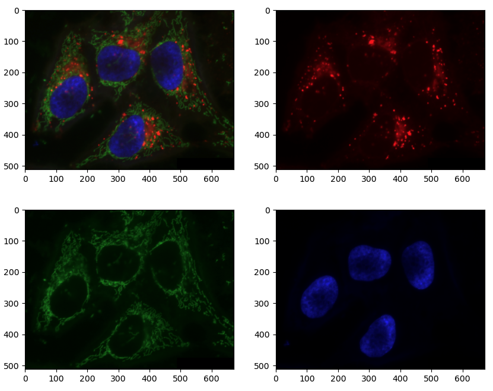
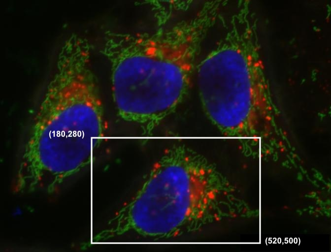
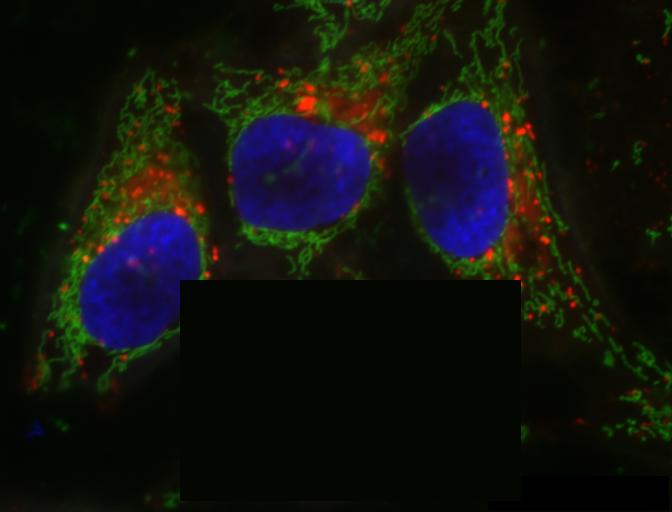

::::::::::::::::::::::::::::::::::::::: objectives

- Read and save images with imageio.
- Display images with Matplotlib.
- Understand RGB vs Multichannel bioimages
- Extract sub-images using array slicing.

::::::::::::::::::::::::::::::::::::::::::::::::::

:::::::::::::::::::::::::::::::::::::::: questions

- How can the scikit-image Python computer vision library be used to work with images?

::::::::::::::::::::::::::::::::::::::::::::::::::

We have covered much of how images are represented in computer software. In this episode we will learn some more methods
for accessing and changing digital images.

## First, import the packages needed for this episode

```python
import imageio.v3 as iio
import ipympl
import matplotlib.pyplot as plt
import numpy as np
import skimage as ski
```

## Reading and displaying images

Imageio provides intuitive functions for reading and writing (saving) images.
All of the popular image formats, such as BMP, PNG, JPEG, and TIFF are supported,
along with several more esoteric formats. Check the
[Supported Formats docs](https://imageio.readthedocs.io/en/stable/formats/index.html)
for a list of all formats.
Matplotlib provides a large collection of plotting utilities.

Let us examine a simple Python program to load, display,
and save an image to a different format.
Here are the first few lines:

```python
"""Python program to open, display, and save an image."""
# read image
cells = iio.imread(uri="data/hela-cells-8bit.tif")
```

We use the `iio.imread()` function to read a TIFF image entitled **hela-cells-8bit**.
Imageio reads the image, converts it from TIFF into a NumPy array,
and returns the array; we save the array in a variable named `cells`.

Next, we will do something with the image:

```python
fig, ax = plt.subplots()
plt.imshow(cells)
```

Once we have the image in the program,
we first call `plt.subplots()` so that we will have
a fresh figure with a set of axis independent from our previous calls.
Next we call `plt.imshow()` in order to display the image.

## Saving images

Another image we will use will be one of scikit-image's example images. 
These can be loaded through the skimage.data module.

```python
hed_image = ski.data.immunohistochemistry()
```

Let's look at this image:

```python
fig, ax = plt.subplots()
plt.imshow(hed_image)
```

What if we want to keep a local copy? 

```python
# save a new version in .tif format
iio.imwrite(uri="data/immunohistochemistry.tif", image=hed_image)
# save a new version in .jpg format
iio.imwrite(uri="data/immunohistochemistry.jpg", image=hed_image)
```

The final statement in the program, `iio.imwrite(uri="data/immunohistochemistry.jpg", image=hed_image)`,
writes the image to a file named `immunohistochemistry.jpg` in the `data/` directory.
The `imwrite()` function automatically determines the type of the file,
based on the file extension we provide.
In this case, the `.tif` extension causes the image to be saved as a TIFF, and the `.jpg` extension
causes the image to be saved as a JPG. Using Finder or File Explorer, check out the size difference
between these two files. As we discussed in [the *Image Basics* episode](02-image-basics.md),
JPG is performing a lossy compression to save a smaller file.

::::::::::::::::::::::::::::::::::::::::  callout

## Metadata, revisited

Remember, as mentioned in the previous section, *images saved with `imwrite()`
will not retain all metadata associated with the original image
that was loaded into Python!*
If the image metadata is important to you, be sure to **always keep an unchanged
copy of the original image!**

::::::::::::::::::::::::::::::::::::::::::::::::::

:::::::::::::::::::::::::::::::::::::::::  callout

## Extensions do not always dictate file type

The `iio.imwrite()` function automatically uses the file type we specify in
the file name parameter's extension.
Note that this is not always the case.
For example, if we are editing a document in Microsoft Word,
and we save the document as `paper.pdf` instead of `paper.docx`,
the file *is not* saved as a PDF document.

::::::::::::::::::::::::::::::::::::::::::::::::::

:::::::::::::::::::::::::::::::::::::::::  callout

## Named versus positional arguments

When we call functions in Python,
there are two ways we can specify the necessary arguments.
We can specify the arguments *positionally*, i.e.,
in the order the parameters appear in the function definition,
or we can use *named arguments*.

For example, the `iio.imwrite()`
[function definition](https://imageio.readthedocs.io/en/stable/_autosummary/imageio.v3.imwrite.html)
specifies two parameters,
the resource to save the image to (e.g., a file name, an http address) and
the image to write to disk.
So, we could save the chair image in the sample code above
using positional arguments like this:

`iio.imwrite("data/immunohistochemistry.jpg", hed_image)`

Since the function expects the first argument to be the file name,
there is no confusion about what `"data/immunohistochemistry.jpg"` means. The same goes
for the second argument.

The style we will use in this workshop is to name each argument, like this:

`iio.imwrite(uri="data/immunohistochemistry.jpg", image=hed_image)`

This style will make it easier for you to learn how to use the variety of
functions we will cover in this workshop.

::::::::::::::::::::::::::::::::::::::::::::::::::

## Converting colour images to grayscale

It is often easier to work with grayscale images, which have a single channel,
instead of colour images, which have three channels.
scikit-image offers the function `ski.color.rgb2gray()` to achieve this.
This function adds up the three colour channels in a way that matches
human colour perception,
see [the scikit-image documentation for details](https://scikit-image.org/docs/dev/api/skimage.color.html#skimage.color.rgb2gray).
It returns a grayscale image with floating point values in the range from 0 to 1.
We can use the function `ski.util.img_as_ubyte()` in order to convert it back to the
original data type and the data range back 0 to 255.
Note that it is often better to use image values represented by floating point values,
because using floating point numbers is numerically more stable.

::::::::::::::::::::::::::::::::::::::::  callout

## Colour and `color`

The Carpentries generally prefers UK English spelling,
which is why we use "colour" in the explanatory text of this lesson.
However, scikit-image contains many modules and functions that include
the US English spelling, `color`.
The exact spelling matters here,
e.g. you will encounter an error if you try to run `ski.colour.rgb2gray()`.
To account for this, we will use the US English spelling, `color`,
in example Python code throughout the lesson.
You will encounter a similar approach with "centre" and `center`.

::::::::::::::::::::::::::::::::::::::::::::::::::

```python
"""Python script to load a color image as grayscale."""

# read input image
hed_color = iio.imread(uri="data/immunohistochemistry.tif")

# display original image
fig, ax = plt.subplots()
plt.imshow(hed_color)

# convert to grayscale and display
hed_gray = ski.color.rgb2gray(hed_color)
fig, ax = plt.subplots()
plt.imshow(hed_gray, cmap="gray")
```

We can also load colour images of certain formats as grayscale directly by
passing the argument `mode="L"` to `iio.imread()`.

```python
"""Python script to load a color image as grayscale."""

# read input image, based on filename parameter
hed_gray = iio.imread(uri="data/immunohistochemistry.jpg", mode="L")

# display grayscale image
fig, ax = plt.subplots()
plt.imshow(hed_gray, cmap="gray")
```

The first argument to `iio.imread()` is the filename of the image.
The second argument `mode="L"` determines the type and range of the pixel values in the image (e.g., an 8-bit pixel has a range of 0-255). This argument is forwarded to the `pillow` backend, a Python imaging library for which mode "L" means 8-bit pixels and single-channel (i.e., grayscale). The backend used by `iio.imread()` may be specified as an optional argument: to use `pillow`, you would pass `plugin="pillow"`. If the backend is not specified explicitly, `iio.imread()` determines the backend to use based on the image type.

:::::::::::::::::::::::::::::::::::::::::  callout

## Loading images with imageio: Pixel type and depth

When loading an image with `mode="L"`, the pixel values are stored as 8-bit integer numbers that can take values in the range 0-255. However, pixel values may also be stored with other types and ranges. For example, some scikit-image functions return the pixel values as floating point numbers in the range 0-1. The type and range of the pixel values are important for the colorscale when plotting, and for masking and thresholding images as we will see later in the lesson. If you are unsure about the type of the pixel values, you can inspect it with `print(image.dtype)`. For the example above, you should find that it is `dtype('uint8')` indicating 8-bit integer numbers.

::::::::::::::::::::::::::::::::::::::::::::::::::

## Multichannel images

In [the *Image Basics* episode](02-image-basics.md) we discussed how color is represented by three numbers in RGB images. The immunohistochemistry image we have been using is an RGB image. The tissue was stained with hematoxylin (blue) and DAB (brown), but if we split apart the RGB color channels, each one isn't particularly useful in identifying that staining:

{alt='A grid showing each RGB color of the immunohistochemistry image'}

In contrast, the image of HeLa cells is a multichannel image. We can conveniently read it and view it using the same functions as RGB, since it's still 8bit with three channels. But in reality, those channels represent fluorescence of three different parts of the cell: lysosomes, mitochondria and nucleus. Currently, the lysosomes are marked in red, mitochondria in green, and nucleus in blue, but it doesn't really matter what color each is represented by. It's often more useful to view multichannel images one channel at a time.

{alt='A grid showing each channel of the hela cells image'}

```python
cells = iio.imread(uri="data/hela-cells-8bit.tif")
nuclei = cells[:,:,2]
fig, ax = plt.subplots()
plt.imshow(nuclei)

mitochondria = cells[:,:,1]
fig, ax = plt.subplots()
plt.imshow(mitochondria, vmax=255)
```

::::::::::::::::::::::::::::::::::::::::  callout

## Plotting single channel images (cmap, vmin, vmax)

Compared to a colour image, a grayscale image or a single channel contains only a
single intensity value per pixel. When we plot such an image with `plt.imshow`,
Matplotlib uses a colour map, to assign each intensity value a colour.
The default colour map is called "viridis" and maps low values to purple
and high values to yellow. We can instruct Matplotlib to map low values
to black and high values to white instead, by calling `plt.imshow` with
`cmap="gray"`.
[The documentation contains an overview of pre-defined colour maps](https://matplotlib.org/stable/gallery/color/colormap_reference.html).

Furthermore, Matplotlib determines the minimum and maximum values of
the colour map dynamically from the image, by default. That means that in
an image where the minimum is 64 and the maximum is 192, those values
will be mapped to black and white respectively (and not dark gray and light
gray as you might expect). If there are defined minimum and maximum vales,
you can specify them via `vmin` and `vmax` to get the desired output.

If you forget about this, it can lead to unexpected results.

::::::::::::::::::::::::::::::::::::::::::::::::::

## Access via slicing

As noted in the previous lesson scikit-image images are stored as NumPy arrays,
so we can use array slicing to select rectangular areas of an image.
Then, we can save the selection as a new image, change the pixels in the image,
and so on.
It is important to
remember that coordinates are specified in *(ry, cx)* order and that colour values
are specified in *(r, g, b)* order when doing these manipulations.

Consider this image of HeLa cells, and suppose that we want to create a sub-image with just one of the cells.

{alt='HeLa cells image'}

Using `matplotlib.pyplot.imshow` 
we can determine the coordinates of the corners of the area we wish to extract
by hovering the mouse near the points of interest and noting the coordinates 
(remember to run `%matplotlib widget` first if you haven't already).
If we do that, we might settle on a rectangular
area with an upper-left coordinate of *(180, 280)*
and a lower-right coordinate of *(520, 500)*,
as shown in this version of the whiteboard picture:

{alt='Sub picture coordinates for one cell'}

Note that the coordinates in the preceding image are specified in *(cx, ry)* order.
Now if our entire whiteboard image is stored as a NumPy array named `image`,
we can create a new image of the selected region with a statement like this:

`clip = image[280:501, 180:521, :]`

Our array slicing specifies the range of y-coordinates or rows first, `280:501`,
and then the range of x-coordinates or columns, `180:521`.
Note we go one beyond the maximum value in each dimension,
so that the entire desired area is selected.
The third part of the slice, `:`,
indicates that we want all three colour channels in our new image.

A script to create the subimage would start by loading the image:

```python
"""Python script demonstrating image modification and creation via NumPy array slicing."""

# load and display original image
cells = iio.imread(uri="data/hela-cell-8bit.tif")
cells = np.array(cells)
fig, ax = plt.subplots()
plt.imshow(cells)
```

Then we use array slicing to
create a new image with our selected area and then display the new image.

```python
# extract, display, and save sub-image
cell_one = cells[280:501, 180:521, :]
fig, ax = plt.subplots()
plt.imshow(cell_one)
iio.imwrite(uri="data/cell_one.tif", image=cell_one)
```

We can also change the values in an image, as shown next.

```python
# replace clipped area with sampled color
color = cells[30,30]
board[280:501, 180:521] = color
fig, ax = plt.subplots()
plt.imshow(board)
```

First, we sample a single pixel's colour at a particular location of the
image, saving it in a variable named `color`,
which creates a 1 × 1 × 3 NumPy array with the blue, green, and red colour values
for the pixel located at *(ry = 30, cx = 30)*.
Then, with the `img[280:501, 180:521] = color` command,
we modify the image in the specified area.
From a NumPy perspective,
this changes all the pixel values within that range to array saved in
the `color` variable.
In this case, the command "erases" that area of the image,
replacing the words with the background black color,
as shown in the final image produced by the program:

{alt='"Erased" one cell from hela cells image'}

:::::::::::::::::::::::::::::::::::::::  challenge

## Practicing with slices (10 min)

Repeat the above exercise for the leftmost cell. Using the techniques you just learned, 
write a script that creates, displays, and saves a sub-image containing
only the leftmost cell from the HeLa cells image.

:::::::::::::::  solution

## Solution

Here is the completed Python program to select only the leftmost cell in the image

```python
"""Python script to extract a sub-image containing only the plant and roots in an existing image."""

# load and display original image
cells = iio.imread(uri="data/hela-cells-8bit.tif")
fig, ax = plt.subplots()
plt.imshow(cells)

# extract and display sub-image
cell_two = cells[70:391, 20:211, :]
fig, ax = plt.subplots()
plt.imshow(cell_two)


# save sub-image
iio.imwrite(uri="data/cell_two.jpg", image=cell_two)
```

:::::::::::::::::::::::::

::::::::::::::::::::::::::::::::::::::::::::::::::

:::::::::::::::::::::::::::::::::::::::: keypoints

- Images are read from disk with the `iio.imread()` function.
- We create a window that automatically scales the displayed image with Matplotlib and calling `imshow()` on the global figure object.
- Colour images can be transformed to grayscale using `ski.color.rgb2gray()` or, in many cases, be read as grayscale directly by passing the argument `mode="L"` to `iio.imread()`.
- Array slicing can be used to extract sub-images or modify areas of images, e.g., `clip = image[280:501, 180:521, :]`.
- Metadata is not retained when images are loaded as NumPy arrays using `iio.imread()`.

::::::::::::::::::::::::::::::::::::::::::::::::::
