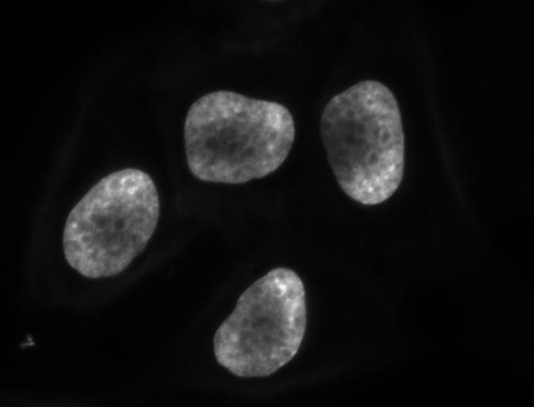
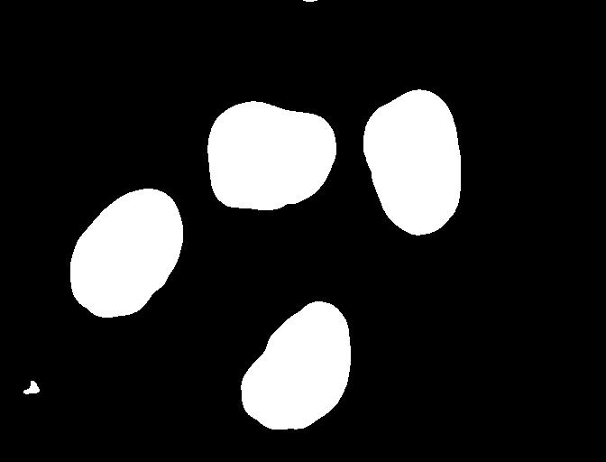
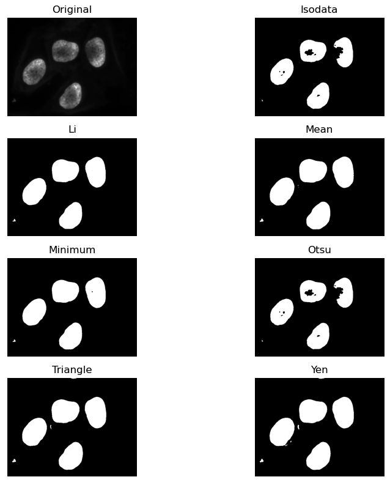

::::::::::::::::::::::::::::::::::::::: objectives

- Explain what thresholding is and how it can be used.
- Use histograms to determine appropriate threshold values to use for the thresholding process.
- Apply simple, fixed-level binary thresholding to an image.
- Explain the difference between using the operator `>` or the operator `<` to threshold an image represented by a NumPy array.
- Describe the shape of a binary image produced by thresholding via `>` or `<`.
- Explain when Otsu's method for automatic thresholding is appropriate.
- Apply automatic thresholding to an image using Otsu's method.
- Use the `np.count_nonzero()` function to count the number of non-zero pixels in an image.

::::::::::::::::::::::::::::::::::::::::::::::::::

:::::::::::::::::::::::::::::::::::::::: questions

- How can we use thresholding to produce a binary image?

::::::::::::::::::::::::::::::::::::::::::::::::::

In this episode, we will learn how to use scikit-image functions to apply
thresholding to an image.
Thresholding is a type of *image segmentation*,
where we change the pixels of an image to make the image easier to analyze.
In thresholding, we convert an image from colour or grayscale into
a *binary image*, i.e., one that is simply black and white.
Most frequently,
we use thresholding as a way to select areas of interest of an image,
while ignoring the parts we are not concerned with.
In this episode, we will learn how to use scikit-image functions to perform thresholding.
Then, we will use the masks returned by these functions to
select the parts of an image we are interested in.

## First, import the packages needed for this episode

```python
import glob

import imageio.v3 as iio
import ipympl
import matplotlib.pyplot as plt
import numpy as np
import skimage as ski

%matplotlib widget
```

## Simple thresholding

Consider the hematoxylin and DAB stained immunohistochemistry image that we saved from the scikit example data
in [the *Working with scikit-image* episode](03-skimage-images.md).

```python
# load the image
hed_image = iio.imread(uri="data/immunohistochemistry.tif")

fig, ax = plt.subplots()
plt.imshow(hed_image)
```

{alt='HED IHC scikit example image'}

Now suppose we want to select only the stained portion of the image.
In other words, we want to leave the pixels belonging to the stained tissue "on,"
while turning the rest of the pixels "off,"
by setting their colour channel values to zeros.
The scikit-image library has several different methods of thresholding.
We will start with the simplest version,
which involves an important step of human input.
Specifically, in this simple, *fixed-level thresholding*,
we have to provide a threshold value `t`.

The process works like this.
First, we will load the original image, convert it to grayscale,
and de-noise it as in [the *Blurring Images* episode](06-blurring.md).

```python
# convert the image to grayscale
hed_gray = ski.color.rgb2gray(hed_image)

# blur the image to denoise
hed_blurred = ski.filters.gaussian(hed_gray, sigma=1.0)

fig, ax = plt.subplots()
plt.imshow(hed_blurred, cmap="gray")
```

{alt='Grayscale and blurred ihc image'}

:::::::::::::::::::::::::::::::::::::::::  callout

## Denoising an image before thresholding

In practice, it is often necessary to denoise the image before
thresholding, which can be done with one of the methods from
[the *Blurring Images* episode](06-blurring.md).


::::::::::::::::::::::::::::::::::::::::::::::::::

Next, we would like to apply the threshold `t` such that
pixels with grayscale values on one side of `t` will be turned "on",
while pixels with grayscale values on the other side will be turned "off".
How might we do that?
Remember that grayscale images contain pixel values in the range from 0 to 1,
so we are looking for a threshold `t` in the closed range [0\.0, 1.0].
We see in the image that the stained tissue is "darker" than
the white background but there is also some light gray noise on the background.
One way to determine a "good" value for `t` is
to look at the grayscale histogram of the image
and try to identify what grayscale ranges correspond to the staining in the image
or the background.

The histogram can be produced as in
[the *Creating Histograms* episode](05-creating-histograms.md).

```python
# create a histogram of the blurred grayscale image
histogram, bin_edges = np.histogram(hed_blurred, bins=256, range=(0.0, 1.0))

fig, ax = plt.subplots()
plt.plot(bin_edges[0:-1], histogram)
plt.title("Grayscale Histogram")
plt.xlabel("grayscale value")
plt.ylabel("pixels")
plt.xlim(0, 1.0)
```

{alt='Grayscale histogram of the blurred ihc image'}

Since the image has a white background,
most of the pixels in the image are almost-white.
This corresponds nicely to what we see in the histogram:
there is a peak above 0.8.
If we want to select the stained tissue and not the background,
we want to turn off the white background pixels,
while leaving the pixels for the staining turned on.
So, we should choose a value of `t` somewhere before the large peak and
turn pixels above that value "off".
Let us choose `t=0.7`.

To apply the threshold `t`,
we can use the NumPy comparison operators to create a mask.
Here, we want to turn "on" all pixels which have values smaller than the threshold,
so we use the less operator `<` to compare the `blurred_image` to the threshold `t`.
The operator returns a mask, that we capture in the variable `binary_mask`.
It has only one channel, and each of its values is either 0 or 1.
The binary mask created by the thresholding operation can be shown with `plt.imshow`,
where the `False` entries are shown as black pixels
(0-valued) and the `True` entries are shown as white pixels
(1-valued).

```python
# create a mask based on the threshold
t = 0.7
binary_mask = hed_blurred < t

fig, ax = plt.subplots()
plt.imshow(binary_mask, cmap="gray")
```

{alt='Binary mask of the stained tissue created by thresholding'}

You can see that the areas where the staining was in the original area are now white,
while the rest of the mask image is black.

:::::::::::::::::::::::::::::::::::::::::  callout

## What makes a good threshold?

As is often the case, the answer to this question is "it depends".
In the example above, we could have just switched off all
the white background pixels by choosing `t=1.0`,
but this would leave us with some background noise in the mask image.
On the other hand, if we choose too low a value for the threshold,
we could lose some of the staining that as too light.
You can experiment with the threshold by re-running the above code lines with
different values for `t`.
In practice, it is a matter of domain knowledge and
experience to interpret the peaks in the histogram so to determine
an appropriate threshold.
The process often involves trial and error,
which is a drawback of the simple thresholding method.
Below we will introduce automatic thresholding,
which uses a quantitative, mathematical definition for a good threshold that
allows us to determine the value of `t` automatically.
It is worth noting that the principle for simple and automatic thresholding
can also be used for images with pixel ranges other than [0\.0, 1.0].
For example, we could perform thresholding on pixel intensity values
in the range [0, 255] as we have already seen in
[the *Working with scikit-image* episode](03-skimage-images.md).


::::::::::::::::::::::::::::::::::::::::::::::::::

We can now apply the `binary_mask` to the original coloured image as we
have learned in [the *Drawing and Bitwise Operations* episode](04-drawing.md).
What we are left with is only the stained tissue from the original.

```python
# use the binary_mask to select the "interesting" part of the image
foreground = hed_image.copy()
foreground[~binary_mask] = 0

fig, ax = plt.subplots()
plt.imshow(foreground)
```

{alt='Selected foreground after applying binary mask'}

:::::::::::::::::::::::::::::::::::::::  challenge

## More practice with simple thresholding (20 min)

Now, it is your turn to practice. Suppose we want to use simple thresholding
to select only the nuclei from the image `data/hela-cells-8bit.tif`:

{alt='HeLa cells color image'}

Since the nuclei are marked in this multichannel image by high values of the blue channel,
there are a few differences. Instead of using the grayscale image, select the blue channel using
`image[:,:,2]`. This will act as your grayscale image, since it also has only one value per pixel.

{alt='HeLa cells gray nuclei'}

:::::::::::::::  solution

## Solution

The histogram for the blue channel of `data/hela-cells-8bit.tif` image can be shown with

```python
cells = iio.imread(uri="data/hela-cells-8bit.tif")
blue_channel = cells[:,:,2]
blurred_image = skimage.filters.gaussian(blue_channel, sigma=1.0)

histogram, bin_edges = np.histogram(blurred_image, bins=256, range=(0.0,1.0))

fig,ax = plt.subplots()
plt.plot(bin_edges[0:-1], histogram)
plt.title("Blue (nuclei) channel histogram")
plt.xlabel("pixel value")
plt.ylabel("pixels")
plt.xlim(0, 1.0)
```

{alt='Histogram of the blue channel from the HeLa cells image'}

We can see a large spike around 0, and a very low bump around 0.3. The
spike near 0 represents the darker background, and the bump around 0.3 represents the nuclei signal.
So it seems like a value between the two would be a good choice. Let's choose `t=0.1`.


:::::::::::::::::::::::::

Next, create a mask to turn the pixels above the threshold `t` on
and pixels below the threshold `t` off. Note that unlike the image
with a white background we used above, here the peak for the
background colour is darker than the foreground objects or nuclei.
Therefore, change the comparison operator less `<` to
greater `>` to create the appropriate mask. Then apply the mask to
the image and view the thresholded image. If everything works as it
should, your output should show only the coloured nuclei on a black
background.

:::::::::::::::  solution

## Solution

Here are the commands to create and view the binary mask

```python
t = 0.1
binary_mask = blurred_image > t

fig, ax = plt.subplots()
plt.imshow(binary_mask, cmap="gray")
```

{alt='Binary mask created by thresholding the HeLa cells image'}

And here are the commands to apply the mask and view the thresholded image

```python
nuclei_only = cells.copy()
nuclei_only[~binary_mask] = 0

fig, ax = plt.subplots()
plt.imshow(nuclei_only)
```

{alt='Selected nuclei after applying binary mask to the HeLa cells image'}

:::::::::::::::::::::::::

::::::::::::::::::::::::::::::::::::::::::::::::::

## Automatic thresholding

The downside of the simple thresholding technique is that we have to
make an educated guess about the threshold `t` by inspecting the histogram.
There are also *automatic thresholding* methods that can determine
the threshold automatically for us.
One such method is *[Otsu's method](https://en.wikipedia.org/wiki/Otsu%27s_method)*.
It is particularly useful for situations where the grayscale histogram of an image
has two peaks that correspond to background and objects of interest. Other automated methods
might work better depending on the shape of the histogram.

Let's apply automated thresholding methods to identify the nuclei in the HeLa cells image:

```python
cells = iio.imread(uri="data/hela-cells-8bit.tif")

# select only the nuclei channel
blue_channel = cells[:,:,2]

# blur the image to denoise
blurred_image = ski.filters.gaussian(blue_channel, sigma=1.0)

# show the histogram of the blurred image
histogram, bin_edges = np.histogram(blurred_image, bins=256, range=(0.0, 1.0))
fig, ax = plt.subplots()
plt.plot(bin_edges[0:-1], histogram)
plt.title("Blue (nuclei) channel histogram")
plt.xlabel("pixel value")
plt.ylabel("pixel count")
plt.xlim(0, 1.0)
```

{alt='Histogram of the blue channel on the HeLa cells image'}

The histogram has a significant peak around 0 and then a broader "hill" around 0.3.
Looking at the grayscale image, we can identify the peak at 0 with the
background and the broader hill around 0.3 with the foreground.
The mathematical details of how automated thresholders work are complicated (see
[the scikit-image documentation](https://scikit-image.org/docs/dev/api/skimage.filters.html#threshold-otsu)
if you are interested),
but the outcome is that Otsu's method finds a threshold value between the two peaks of a grayscale
histogram which might correspond well to the foreground and background depending on the data and 
application.

:::::::::::::::::::::::::::::::::::::::::::::::::::::::::::::::::::: instructor

The histogram  may prompt questions from learners about the interpretation 
of the peaks and the broader region. The focus here is on the separation of background 
and foreground pixel values. We note that Otsu's method does not work very well as the foreground pixel values are more 
distributed. These examples could be augmented with a discussion of unimodal, bimodal, and multimodal
histograms. While these points can lead to fruitful considerations, the text in this episode attempts 
to reduce cognitive load and deliberately simplifies the discussion.

::::::::::::::::::::::::::::::::::::::::::::::::::::::::::::::::::::

The `ski.filters.threshold_otsu()` function can be used to determine
the threshold automatically via Otsu's method.
Then NumPy comparison operators can be used to apply it as before.
Here are the Python commands to determine the threshold `t` with Otsu's method.

```python
# perform automatic thresholding
t = ski.filters.threshold_otsu(blurred_image)
print("Found automatic threshold t = {}.".format(t))
```

```output
Found automatic threshold t = 0.4172454549881862.
```

For this root image and a Gaussian blur with the chosen sigma of 1.0,
the computed threshold value is 0.21.
No we can create a binary mask with the comparison operator `>`.
As we have seen before, pixels above the threshold value will be turned on,
those below the threshold will be turned off.

```python
# create a binary mask with the threshold found by Otsu's method
binary_mask = blurred_image > t

fig, ax = plt.subplots()
plt.imshow(binary_mask, cmap="gray")
```

{alt='Binary mask of nuclei using otsu thresholding'}

Otsu's method generates a fairly conservative mask on this image, meaning that
the threshold was fairly high and less of the foreground is kept by the mask.
There may be other automated thresholders that work better in this application.
Scikit image provites a method that can give a visual test of all of them at once.

```python
fig, ax = ski.filters.try_all_threshold(blurred_image, figsize=(10, 8), verbose=False)
plt.show()
```

{alt='Overview test of all automated thresholders in scikit image'}

:::::::::::::::::::::::::::::::::::::::  challenge

## Thresholding a bacteria colony image (15 min)

In the images directory `data/`, you will find an image named `colonies-01.tif`.

{alt='Image of bacteria colonies in a petri dish'}

This is one of the images you will be working with in the
morphometric challenge at the end of the workshop.

1. Plot and inspect the grayscale histogram of the image to
  determine a good threshold value for the image.
2. Create a binary mask that leaves the pixels in the bacteria
  colonies "on" while turning the rest of the pixels in the image
  "off".

:::::::::::::::  solution

## Solution

Here is the code to create the grayscale histogram:

```python
bacteria = iio.imread(uri="data/colonies-01.tif")
gray_image = ski.color.rgb2gray(bacteria)
blurred_image = ski.filters.gaussian(gray_image, sigma=1.0)
histogram, bin_edges = np.histogram(blurred_image, bins=256, range=(0.0, 1.0))
fig, ax = plt.subplots()
plt.plot(bin_edges[0:-1], histogram)
plt.title("Graylevel histogram")
plt.xlabel("gray value")
plt.ylabel("pixel count")
plt.xlim(0, 1.0)
```
 
{alt='Grayscale histogram of the bacteria colonies image'}

The peak near one corresponds to the white image background,
and the broader peak around 0.5 corresponds to the yellow/brown
culture medium in the dish.
The small peak near zero is what we are after: the dark bacteria colonies.
A reasonable choice thus might be to leave pixels below `t=0.2` on.

Here is the code to create and show the binarized image using the
`<` operator with a threshold `t=0.2`:

```python
t = 0.2
binary_mask = blurred_image < t

fig, ax = plt.subplots()
plt.imshow(binary_mask, cmap="gray")
```

{alt='Binary mask of the bacteria colonies image'}

When you experiment with the threshold a bit, you can see that in
particular the size of the bacteria colony near the edge of the
dish in the top right is affected by the choice of the threshold.


:::::::::::::::::::::::::

::::::::::::::::::::::::::::::::::::::::::::::::::

:::::::::::::::::::::::::::::::::::::::: keypoints

- Thresholding produces a binary image, where all pixels with intensities above (or below) a threshold value are turned on, while all other pixels are turned off.
- The binary images produced by thresholding are held in two-dimensional NumPy arrays, since they have only one colour value channel. They are boolean, hence they contain the values 0 (off) and 1 (on).
- Thresholding can be used to create masks that select only the interesting parts of an image, or as the first step before edge detection or finding contours.

::::::::::::::::::::::::::::::::::::::::::::::::::
