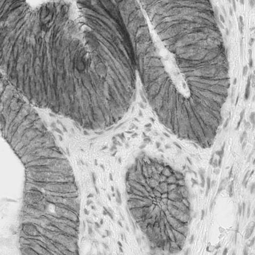
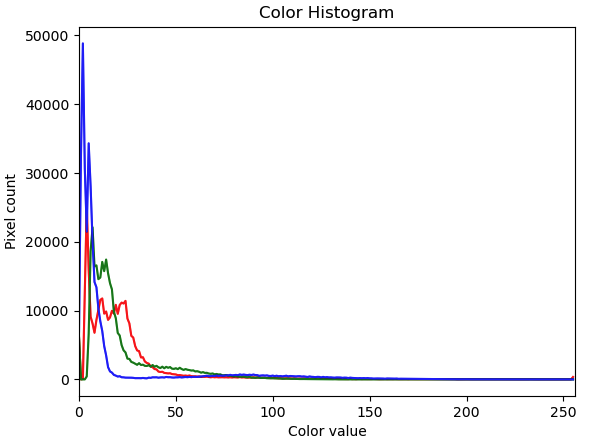
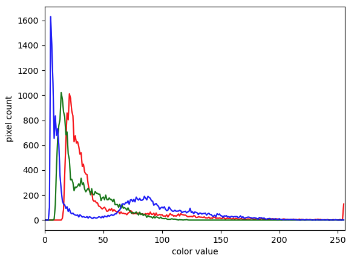

::::::::::::::::::::::::::::::::::::::: objectives

- Explain what a histogram is.
- Load an image in grayscale format.
- Create and display grayscale and colour histograms for entire images.
- Create and display grayscale and colour histograms for certain areas of images, via masks.

::::::::::::::::::::::::::::::::::::::::::::::::::

:::::::::::::::::::::::::::::::::::::::: questions

- How can we create grayscale and colour histograms to understand the distribution of colour values in an image?

::::::::::::::::::::::::::::::::::::::::::::::::::

In this episode, we will learn how to use scikit-image functions to create and
display histograms for images.

## First, import the packages needed for this episode

```python
import imageio.v3 as iio
import ipympl
import matplotlib.pyplot as plt
import numpy as np
import skimage as ski

%matplotlib widget
```

## Introduction to Histograms

As it pertains to images, a *histogram* is a graphical representation showing
how frequently various colour values occur in the image.
We saw in
[the *Image Basics* episode](02-image-basics.md)
that we could use a histogram to visualise
the differences in uncompressed and compressed image formats.
If your project involves detecting colour changes between images,
histograms will prove to be very useful,
and histograms are also quite handy as a preparatory step before performing
[thresholding](07-thresholding.md).

## Grayscale Histograms

We will start with grayscale images,
and then move on to colour images.
We will use this hematoxylin and DAB stained immunohistochemistry image as an example:
{alt='HED IHC scikit example image'}

Here we load the image in grayscale instead of full colour, and display it:

```python
# read the immunohistochemistry image as grayscale from the outset
hed_image = iio.imread(uri="data/immunohistochemistry.tif")
hed_image = ski.color.rgb2gray(hed_image)

# convert the image to float dtype with a value range from 0 to 1
hed_image = ski.util.img_as_float(hed_image)

# display the image
fig, ax = plt.subplots()
ax.imshow(hed_image, cmap="gray")
```

{alt='grayscale verson of IHC image'}

Again, we use the `iio.imread()` function to load our image.
Then, we convert the grayscale image of integer dtype, with 0-255 range, into
a floating-point one with 0-1 range, by calling the function
`ski.util.img_as_float`. We can also calculate histograms for 8 bit images as we will see in the
subsequent exercises.

We now use the function `np.histogram` to compute the histogram of our image
which, after all, is a NumPy array:

```python
# create the histogram
histogram, bin_edges = np.histogram(hed_image, bins=256, range=(0, 1))
```

The parameter `bins` determines the number of "bins" to use for the histogram.
We pass in `256` because we want to see the pixel count for each of
the 256 possible values in the grayscale image.

The parameter `range` is the range of values each of the pixels in the image can have.
Here, we pass 0 and 1,
which is the value range of our input image after conversion to floating-point.

The first output of the `np.histogram` function is a one-dimensional NumPy array,
with 256 rows and one column,
representing the number of pixels with the intensity value corresponding to the index.
I.e., the first number in the array is
the number of pixels found with intensity value 0,
and the final number in the array is
the number of pixels found with intensity value 255.
The second output of `np.histogram` is
an array with the bin edges and one column and 257 rows
(one more than the histogram itself).
There are no gaps between the bins, which means that the end of the first bin,
is the start of the second and so on.
For the last bin, the array also has to contain the stop,
so it has one more element, than the histogram.

Next, we turn our attention to displaying the histogram,
by taking advantage of the plotting facilities of the Matplotlib library.

```python
# configure and draw the histogram figure
fig, ax = plt.subplots()
ax.set_title("Grayscale Histogram")
ax.set_xlabel("grayscale value")
ax.set_ylabel("pixel count")
ax.set_xlim([0.0, 1.0])  # <- named arguments do not work here

ax.plot(bin_edges[0:-1], histogram)  # <- or here
```

We create the plot with `plt.subplots()`,
then label the figure and the coordinate axes with `ax.set_title()`,
`ax.set_xlabel()`, and `ax.set_ylabel()` functions.
The last step in the preparation of the figure is to
set the limits on the values on the x-axis with
the `ax.set_xlim([0.0, 1.0])` function call.

:::::::::::::::::::::::::::::::::::::::::  callout

## Variable-length argument lists

Note that we cannot used named parameters for the
`ax.set_xlim()` or `ax.plot()` functions.
This is because these functions are defined to take an arbitrary number of
*unnamed* arguments.
The designers wrote the functions this way because they are very versatile,
and creating named parameters for all of the possible ways to use them
would be complicated.


::::::::::::::::::::::::::::::::::::::::::::::::::

Finally, we create the histogram plot itself with
`ax.plot(bin_edges[0:-1], histogram)`.
We use the **left** bin edges as x-positions for the histogram values by
indexing the `bin_edges` array to ignore the last value
(the **right** edge of the last bin).
When we run the program on the immunohistochemistry image,
it produces this histogram:

{alt='Grayscale immunohistochemistry histogram'}

:::::::::::::::::::::::::::::::::::::::::  callout

## Histograms in Matplotlib

Matplotlib provides a dedicated function to compute and display histograms:
`ax.hist()`.
We will not use it in this lesson in order to understand how to
calculate histograms in more detail.
In practice, it is a good idea to use this function,
because it visualises histograms more appropriately than `ax.plot()`.
Here, you could use it by calling
`ax.hist(image.flatten(), bins=256, range=(0, 1))`
instead of
`np.histogram()` and `ax.plot()`
(`*.flatten()` is a NumPy function that converts our two-dimensional
image into a one-dimensional array).

::::::::::::::::::::::::::::::::::::::::::::::::::

## Colour Histograms

We can also create histograms for full colour images,
in addition to grayscale histograms.
A program to create colour histograms starts in a familiar way:

```python
# read original image, in full color
cells = iio.imread(uri="data/hela-cells-8bit.tif")

# display the image
fig, ax = plt.subplots()
ax.imshow(cells)
```

We read the original image, now in full colour, and display it.

Next, we create the histogram, by calling the `np.histogram` function three
times, once for each of the channels.
We obtain the individual channels, by slicing the image along the last axis.
For example, we can obtain the red colour channel by calling
`r_chan = image[:, :, 0]`.

```python
# tuple to select colors of each channel line
colors = ("red", "green", "blue")

# create the histogram plot, with three lines, one for
# each color
fig, ax = plt.subplots()
ax.set_xlim([0, 256])
for channel_id, color in enumerate(colors):
    histogram, bin_edges = np.histogram(
        cells[:, :, channel_id], bins=256, range=(0, 256)
    )
    ax.plot(bin_edges[0:-1], histogram, color=color)

ax.set_title("Color Histogram")
ax.set_xlabel("Color value")
ax.set_ylabel("Pixel count")
```

We will draw the histogram line for each channel in a different colour,
and so we create a tuple of the colours to use for the three lines with the

`colors = ("red", "green", "blue")`

line of code.
Then, we limit the range of the x-axis with the `ax.set_xlim()` function call.

Next, we use the `for` control structure to iterate through the three channels,
plotting an appropriately-coloured histogram line for each.
This may be new Python syntax for you,
so we will take a moment to discuss what is happening in the `for` statement.

The Python built-in `enumerate()` function takes a list and returns an
*iterator* of *tuples*, where the first element of the tuple is the index and the second element is the element of the list.

:::::::::::::::::::::::::::::::::::::::::  callout

## Iterators, tuples, and `enumerate()`

In Python, an *iterator*, or an *iterable object*, is
something that can be iterated over with the `for` control structure.
A *tuple* is a sequence of objects, just like a list.
However, a tuple cannot be changed,
and a tuple is indicated by parentheses instead of square brackets.
The `enumerate()` function takes an iterable object,
and returns an iterator of tuples consisting of
the 0-based index and the corresponding object.

For example, consider this small Python program:

```python
list = ("a", "b", "c", "d", "e")

for x in enumerate(list):
    print(x)
```

Executing this program would produce the following output:

```output
(0, 'a')
(1, 'b')
(2, 'c')
(3, 'd')
(4, 'e')
```

::::::::::::::::::::::::::::::::::::::::::::::::::

In our colour histogram program, we are using a tuple, `(channel_id, color)`,
as the `for` variable.
The first time through the loop, the `channel_id` variable takes the value `0`,
referring to the position of the red colour channel,
and the `color` variable contains the string `"red"`.
The second time through the loop the values are the green channels index `1` and
`"green"`, and the third time they are the blue channel index `2` and `"blue"`.

Inside the `for` loop, our code looks much like it did for the
grayscale example. We calculate the histogram for the current channel
with the

`histogram, bin_edges = np.histogram(image[:, :, channel_id], bins=256, range=(0, 256))`

function call,
and then add a histogram line of the correct colour to the plot with the

`ax.plot(bin_edges[0:-1], histogram, color=color)`

function call.
Note the use of our loop variables, `channel_id` and `color`.

Finally we label our axes and display the histogram, shown here:

{alt='Colour histogram'}

:::::::::::::::::::::::::::::::::::::::::  callout

## Code cheatsheet for "Colour histogram with a mask":

Drawing a mask:
```python
# Create mask where background is zeros
mask = np.zeros(shape=image.shape[0:2], dtype="bool")
# Draw a circle with center at (yr, xc) with radius r
circle = ski.draw.disk(center=(yr, xc), radius=r, shape=image.shape[0:2])
mask[circle] = 1

# Get pixels from image where mask is true (e.g. inside circle)
image[mask]
```

Histograms:
```python
import imageio.v3 as iio
import ipympl
import matplotlib.pyplot as plt
import numpy as np
import skimage as ski
%matplotlib widget

# read original image, in full color, from uri path to image file
image = iio.imread(uri)

# tuple to select colors of each channel line
colors = ("red", "green", "blue")
# create the histogram plot, with three lines, one for
# each color
plt.figure()
plt.xlim([0, 256])
for channel_id, color in enumerate(colors):
    histogram, bin_edges = np.histogram(
        image[:, :, channel_id], bins=256, range=(0, 256)
    )
    plt.plot(bin_edges[0:-1], histogram, color=color)

plt.title("Color Histogram")
plt.xlabel("Color value")
plt.ylabel("Pixel count")
```

::::::::::::::::::::::::::::::::::::::::::::::::::

:::::::::::::::::::::::::::::::::::::::  challenge

## Colour histogram with a mask (25 min)

Looking at the histogram above, you will notice that there is a large number of very dark pixels
in each channel. This is not so surprising, since the image has a mostly black background.
What if we want to focus on a more foreground part of the image, like just one of the cells.
This is where a mask enters the picture!

Hover over the image with your mouse to find the centre of that cell
and the radius (in pixels) of the cell.
Then, using techniques from [the *Drawing and Bitwise Operations* episode](04-drawing.md), 
create a circular mask to select only the desired cell.
Then, use that mask to apply the colour histogram operation to that cell.

Your masked image should look something like this:

{alt='Masked cell'}

And, the program should produce a colour histogram that looks like this:

{alt='Single cell histogram'}

:::::::::::::::  solution

## Solution

```python
# create a circular mask to select the lowest cell in the image
mask = np.zeros(shape=cells.shape[0:2], dtype="bool")
circle = ski.draw.disk(center=(400, 360), radius=80, shape=cells.shape[0:2])
mask[circle] = 1

# just for display:
# make a copy of the image, call it masked_image, and
# zero values where mask is False
masked_img = np.array(cells)
masked_img[~mask] = 0

# create a new figure and display masked_img, to verify the
# validity of your mask
fig, ax = plt.subplots()
ax.imshow(masked_img)

# list to select colors of each channel line
colors = ("red", "green", "blue")

# create the histogram plot, with three lines, one for
# each color
fig, ax = plt.subplots()
ax.set_xlim([0, 256])
for (channel_id, color) in enumerate(colors):
    # use your circular mask to apply the histogram
    # operation to the lowest cell of the image
    histogram, bin_edges = np.histogram(
        cells[:, :, channel_id][mask], bins=256, range=(0, 256)
    )

    ax.plot(histogram, color=color)

ax.set_xlabel("color value")
ax.set_ylabel("pixel count")

```

:::::::::::::::::::::::::

::::::::::::::::::::::::::::::::::::::::::::::::::

:::::::::::::::::::::::::::::::::::::::: keypoints

- We can create histograms of images with the `np.histogram` function.
- We can display histograms using `ax.plot()` with the `bin_edges` and `histogram` values returned by `np.histogram()`.
- The plot can be customised using `ax.set_xlabel()`, `ax.set_ylabel()`, `ax.set_xlim()`, `ax.set_ylim()`, and `ax.set_title()`.
- We can separate the colour channels of an RGB image using slicing operations and create histograms for each colour channel separately.

::::::::::::::::::::::::::::::::::::::::::::::::::
