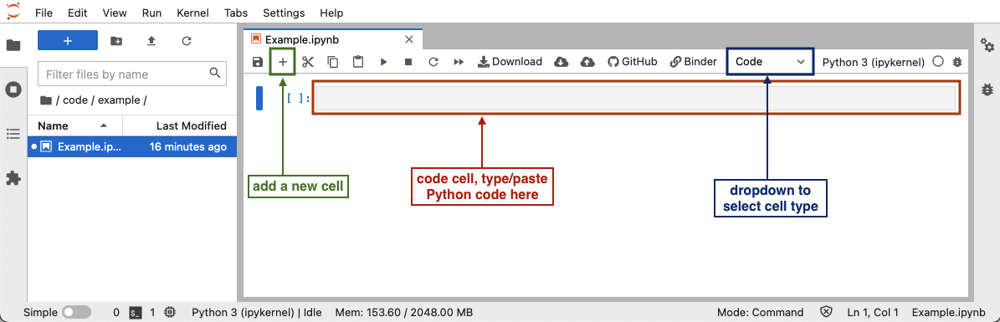

Before joining the workshop or following the lesson, please complete the data and software setup described in this page.

## Data

The example images used in this lesson are available on Zenodo.
To download the data, please visit [the dataset page for this workshop](https://zenodo.org/doi/10.5281/zenodo.10839732)
and click the "Download all" button.
Unzip the downloaded file, and save the contents as a folder  called `data` somewhere you will easily find it again,
e.g. your Desktop or a folder you have created for using in this workshop.
(The name `data` is optional but recommended, as this is the name we will use to refer to the folder throughout the lesson.)

## Software

1. Check your conda distribution. On terminal (Mac) or Powershell/WSL (Windows), run:

   ```shell
   conda info
   mamba info
   ```
   If either command returns information, skip to creating a new environment. 

1. Download and install the latest [Miniforge
   distribution](https://github.com/conda-forge/miniforge) If you wish to use an existing
   installation, please use a new conda environment to ensure all packages are up to date.

   ::::::::::::::::  spoiler

   ## Instructions for Windows

   If running the `conda` commands on the standard Command Prompt or Powershell returns an error:
   `'conda' is not recognized as an internal or external command, operable program or batch file.`

   Use the Miniforge Prompt in the Start menu instead.

   :::::::::::::::::::::::::

3. Create a new environment with the necessary packages

   ```shell
   conda create -n imaging-workshop python=3.9 scikit-image ipympl jupyterlab -c conda-forge
   ```

   :::::::::::::::::::::::::::::::::::::::::  callout

   ## Enabling the  `ipympl`  backend in Jupyter notebooks

   This lesson uses Matplotlib features to display images, and some
   interactive features will be valuable. To enable the interactive
   tools in JupyterLab, the `ipympl` package is required.

   The `ipympl` backend can be enabled with the `%matplotlib` Jupyter
   magic. Put the following command in a cell in your notebooks
   (e.g., at the top) and execute the cell before any plotting commands.

   ```python
   %matplotlib widget
   ```

   ## Older JupyterLab versions

   If you are using an older version of JupyterLab, you may also need
   to install the labextensions manually, as explained in the [README
   file](https://github.com/matplotlib/ipympl#readme) for the `ipympl`
   package.

   ::::::::::::::::::::::::::::::::::::::::::::::::::

4. Start environment

   ```shell
   conda activate imaging-workshop
   ```

3. Open a Jupyter notebook:

   ```shell
   jupyter lab
   ```

   After Jupyter Lab has launched, click the "Python 3" button under "Notebook" in the launcher window,
   or use the "File" menu, to open a new Python 3 notebook.

4. To test your environment, run the following lines in a cell of the notebook:

   ```python
   import imageio.v3 as iio
   import matplotlib.pyplot as plt
   import skimage as ski

   %matplotlib widget

   # load an image
   image = iio.imread(uri='data/colonies-01.tif')

   # rotate it by 45 degrees
   rotated = ski.transform.rotate(image=image, angle=45)

   # display the original image and its rotated version side by side
   fig, ax = plt.subplots(1, 2)
   ax[0].imshow(image)
   ax[1].imshow(rotated)
   ```

   Upon execution of the cell, a figure with two images should be displayed in an interactive widget. When hovering over the images with the mouse pointer, the pixel coordinates and colour values are displayed below the image.

   ::::::::::::::::  spoiler

   ## Running Cells in a Notebook

   {alt='Overview of the Jupyter Notebook graphical user interface'}
   To run Python code in a Jupyter notebook cell, click on a cell in the notebook
   (or add a new one by clicking the `+` button in the toolbar),
   make sure that the cell type is set to "Code" (check the dropdown in the toolbar),
   and add the Python code in that cell.
   After you have added the code,
   you can run the cell by selecting "Run" -> "Run selected cell" in the top menu,
   or pressing <kbd>Shift</kbd>\+<kbd>Enter</kbd>.

   :::::::::::::::::::::::::
